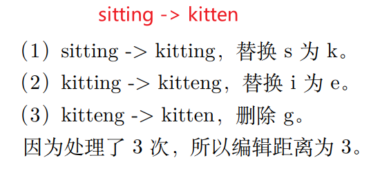
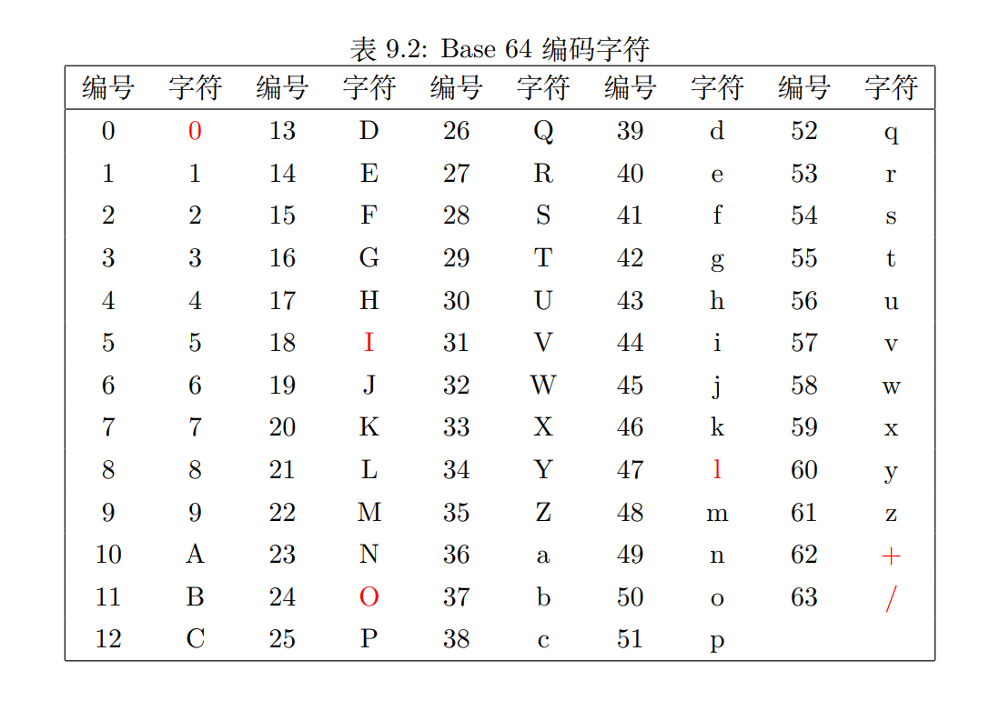

# 实战


## 本章目标
- 用 Rust 数据结构和算法来完成实战项目
- 学习并理解实战项目中的数据结构和算法


## 编辑距离
### 汉明距离


汉明距离(Hamming distance)是指两个相同长度的序列在相同位置上有多少个符号不同  
汉明距离同时也是一种编辑距离，即将一个字符串转换成另一个字符串需要经过多少次替换操作  
汉明距离多用于编码中的错误更正  

### 莱文斯坦距离


莱文斯坦距离又称编辑距离(Edit distance)，是一种量化两字符串差异的算法，表示从一个字符串转换为另一个字符串最少需要多少次编辑操作  
这些操作包括插入、删除、替换


## 字典树
Trie是一种树数据结构，又称为字典树，前缀树，用于检索某个单词或前缀是否存在于树中


## 过滤器
### 布隆过滤器
**问题引入:** 要判断一个元素是否在一个集合中  
**解决方案:** 
1. 哈希表虽然快速准确，但是当数据量很大时就很费空间
2. 布隆过滤器，由布隆(Burton Howard Bloom)于1970年提出。
   - 包含一个能保存n个数据的二进制向量(位数组)和k个哈希函数
   - 优点是空间效率和查询效率都远远超过一般的数据结构，缺点是有一定的识别误差率且删除较困难
   - 支持插入和查询两种基本操作
   - 空间复杂度为 O(m), 时间复杂度为 O(k), 因为k非常小, 所以可以看成 O(1)


### 布谷鸟过滤器
**问题引入:** 布隆过滤器的缺点如下:
1. 随着插入数据越多，误差率越来越大
2. 不能删除数据
3. 布隆过滤器随机存储，在具有Cache的CPU上性能不好

布谷鸟过滤器是改进的布隆过滤器，它的哈希函数是成对的，分别将数据映射到两个位置，一个是保存的位置，另一个是备用位置，用于处理碰撞


通过反复实验和测试，桶大小为4时性能最佳。布谷鸟过滤器具有以下四个主要优点:
1. 支持动态添加和删除项
2. 比布隆过滤器更高的查找性能，即使当其接近满载
3. 比其他的布隆过滤器诸如商数过滤器等替代品更容易实现
4. 在实际应用中，若假阳性率 ϵ 小于 3%，则其使用空间小于布隆过滤器


## 缓存淘汰算法LRU
LRU (Least Recently Used, 最近最少使用) 算法用于在存储有限的情况下，根据数据的访问记录来淘汰数据  
这种算法的原理是 "如果数据最近被访问过，那么将来被访问的几率也更高"，见下图示意:  
1. 已知存储容量为5，目前已缓存了4个用户


2. 业务方访问用户5，由于用户5未被存储，所以需新增插入


3. 业务方访问用户2，由于用户2已被存储，所以需将用户2重新插入


4. 业务方访问用户6，由于用户6未被存储，所以需新增插入


5. 对于第4步，由于存储容量为5，所以需要淘汰1个用户


## 一致性哈希算法


## Base58编码
Base58和Base64一样，是一种编码算法。用于表示比特币钱包地址，由中本聪引入  
Base58在Base64的基础上删除了易引起歧义的字符(下图中的红色字符)，包括0(零)、O(大写o)、I(大写i)、l(小写L)，以及+和/字符，剩下的58个字符作为编码字符  



**Base58编码:** 先将字符转换为ASCII，然后转换为10进制，接着是58进制，最后按照编码表选择对应字符组成Base58编码字符串。
算法如下:  
```text
Base58编码流程

  Data: 原始字符串s
  Result: 编码后字符串 b58_str
1 初始化一个空字符串b58_str用于保存结果
2 for c ∈ s do
3 |    将s中字节c转换成ASCII值(256进制)
4 |    将256进制数字转换成10进制数字
5 |    将10进制数字转换成58进制数字
6 |    将58进制数字按照Base58字符表转换成对应字符
7 |    将得到的字符加入b58_str
8 end
9 返回编码后的字符串b58_str
```
**Base58解码:** 先将其中Base58字符串中字符转换为ASCII值，然后再转到10进制，接着转到256进制，最后再转到ASCII字符。
算法如下:
```text
Base58解码流程

  Data: 编码后字符串b58
  Result: 解码后字符串new_str
1 初始化一个空字符串new_str用于保存结果
2 for c ∈ b58 do
3 |    将b58中字节c转换成ASCII值(58进制)
4 |    将58进制数字转换成10进制数字
5 |    将10进制数字转换成256进制数字
6 |    将256进制数字按照ASCII表转换成对应字符
7 |    将得到的字符加入new_str
8 end
9 返回解码后的字符串new_str
```

## 区块链
### 区块链及比特币原理
区块链技术是利用链式数据结构来验证与存储数据、利用分布式节点共识算法来生成和更新数据、利用密码学来保证数据传输和访问安全、利用自动化脚本组成的
智能合约来编程和操作数据的一种全新的分布式基础架构与计算范式。

简单来说，区块链就是去中心化的分布式账本。  

分布式账本，意味着数据的存储不只是在每一个节点上，而是每一个节点会复制并共享整个账本的数据。  

区块链是记录交易的账本，而记录交易是非常耗费资源的，所以在记录交易(打包)的过程中产生了奖励和手续费，这种奖励和手续费是一种数字货币，
用于维持系统的运行。

中本聪发明的区块链中的数字货币就是大名鼎鼎的比特币，它也是第一种数字货币。

区块链作为一个系统，它本身存在区块、区块链、交易、账户、矿工、手续费、奖励等组件。要实现区块链系统，就要从这些基本的组件开始，逐一实现。

### 基础区块链


见[blockchain_1](./_7_blockchain/blockchain_1/)

### 工作量证明
区块链系统通过维持一个计算任务的难度，使得产生区块稳定有序。

计算任务又称工作量证明，通过要求矿工对区块计算一个哈希值并满足某个难度要求，若通过则加入链，并给予奖励。

每打包一个区块就是要构造一个工作量任务

见[blockchain_2](./_7_blockchain/blockchain_2)

### 区块链存储
前面我们实现了区块链，但每次运行后，上一次的链就没有了，所以可以考虑将链保下来。

选择`LevelDB`来保存，当然`RocksDB`也行

### 交易
前面我们的交易都是使用字符串来代替，其实交易涉及交易双方、金额、手续费等信息

### 账户
前面的交易结构体包含`from`和`to`字段，表示交易的账户，然而实际上我们并没有账户。

账户要包含地址、余额，其次还可以包含姓名、哈希标志。

### 梅根哈希
计算所有交易的哈希值: 梅根哈希

首先创建一棵梅根树来放置所有哈希值，然后两两合并再求哈希值并放入梅根树中，最后得到唯一的一个哈希值作为`tx_hash`填入header。

### 矿工及挖矿
区块链的交易会通过打包来保存成区块，打包过程又被称为挖矿。

矿工第一笔交易是coinbase交易，如果最后打包成功则获得挖矿奖励50比特币(随时间半衰)。其他的交易则陆续加入。然后进行工作量证明，开始挖矿。

### 比特币奖励
最后一步就是将矿工挖矿该得的收益支付给矿工


## 总结
```text
   本章的实践包含许多数据结构，而且都非常有用。我们学习了如何实现字典树，布隆和
布谷鸟过滤器；懂得了汉明距离的原理，编辑距离需要动态规划来解决；缓存淘汰算法LRU
和一致性哈希算法非常常用。最后逐步实现的区块链是最复杂的项目，它使用到了各种数据
结构，算是全书综合复习。
```
