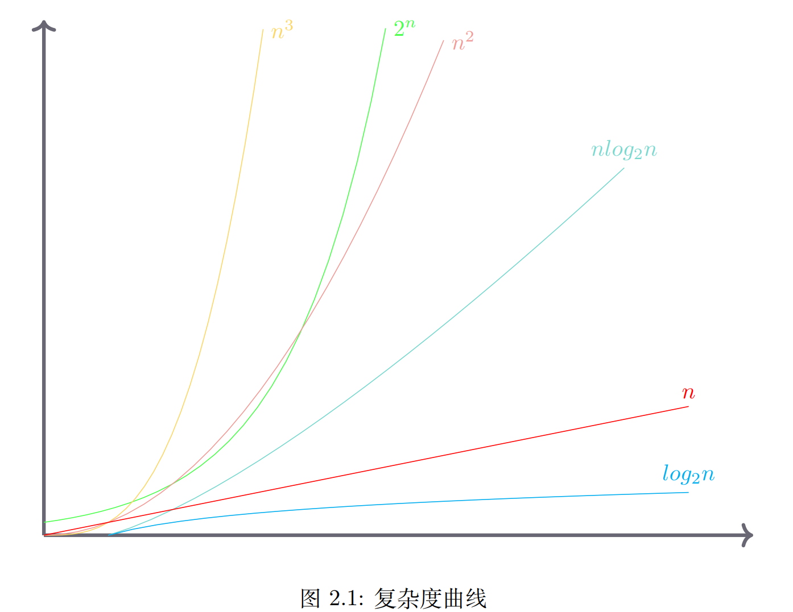

## 本章目标
- 理解算法分析的重要性
- 能够使用大 O 符号分析算法执行时间
- 理解 Rust 数组等数据结构的大 O 分析结果
- 理解 Rust 数据结构的实现是如何影响算法分析的
- 学习对简单的 Rust 程序做性能基准测试

### 乱序字符串检查
> 乱序字符串是指一个字符串只是另一个字符串的重新排列。
> 例如，‘heart’ 和 ‘earth’ 就是乱序字符串，‘rust’ 和 ‘trus’ 也是。
> 为简单起见，假设所讨论的两个字符串具有相等的长度，且都由 26 个小写字母集合组成。
> 我们的目标是写一个函数，它将两个字符串做为参数并返回它们是不是乱序字符串。

#### 解法一：穷举法
> 可以生成 s1 的所有乱序字符串列表，然后查看这些列表里是否有一个和 s2 相同
>
> 此时该算法的时间复杂度为 O(n!)

#### 解法二：检查法
> 此时该算法的时间复杂度为 O(n^2)

#### 解法三：排序并比较法
> 此时该算法的时间复杂度为 O(n^2)或 O(nlogn)

#### 解法四：计数并比较法
> 此时该算法的时间复杂度为 O(n)

### 时间复杂度曲线

```text
在一般情况下（n > 10），存在 O(2^n) > O(n^3) > O(n^2) > O(nlogn) > O(n) > O(logn) > O(1)
```

## 总结
> 本章学习了算法复杂度分析的大 O 分析法：计算代码执行的步数，并取其最大数量级。
> 接着学习了 Rust 实现的基本数据类型和集合数据类型的复杂度，通过对比学习，可知 Rust
> 内置的标量、复合以及集合数据类型都非常高效，基于这些集合类型来实现自定义的数据结
> 构也就更容易做到高效实用。