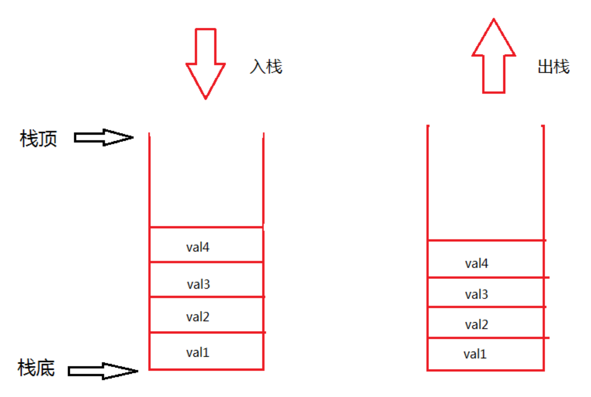
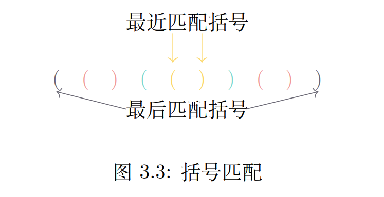

## 栈的抽象数据类型
### 概念


只能在一端插入或删除

先进后出(First In Last Out, FILO)

后进先出(Last In First Out, LIFO)


### 操作
- new() 创建一个空栈，无需入参，返回一个空栈
- push(item) 将数据项item添加到栈顶，需item作为入参，不返回任何值
- pop() 从栈顶删除顶部数据项，无需入参，返回数据项，栈被修改
- peek() 查看栈顶数据项，不删除它，无需入参，不修改栈
- is_empty() 判断栈是否为空，无需入参，返回布尔值
- size() 返回栈中数据项的个数，无需入参，返回一个usize型整数

### 操作示意
| No | 栈操作          | 栈当前值        | 操作返回值 |
|----|--------------|-------------|-------|
| 1  | s.is_empty() | []          | true  |
| 2  | s.push(1)    | [1]         |       |
| 3  | s.push(2)    | [1,2]       |       |
| 4  | s.peek()     | [1,2]       | 2     |
| 5  | s.push(3)    | [1,2,3]     |       |
| 6  | s.size()     | [1,2,3]     | 3     |
| 7  | s.is_empty() | [1,2,3]     | false |
| 8  | s.push(4)    | [1,2,3,4]   |       |
| 9  | s.push(5)    | [1,2,3,4,5] |       |
| 10 | s.size()     | [1,2,3,4,5] | 5     |
| 11 | s.pop()      | [1,2,3,4]   | 5     |
| 12 | s.pop()      | [1,2,3]     | 4     |
| 13 | s.size()     | [1,2,3]     | 3     |

### 括号匹配


### 进制转换


### 中缀表达式转后缀表达式


##### 示例
```
原始表达式:   A * B  +  C * D

     栈顶:               * *
     栈底:     * *   + + + + + 
  动态数组:   A   B *   C   D * +
```

##### 具体步骤
1. 创建一个名为op_stack的空栈以保存运算符。给输出创建一个空列表postfix。
2. 通过使用字符串方法拆分将输入的中缀字符串转换为标记列表str_str。
3. 从左到右扫描标记列表：   
   如果标记是操作数，将其附加到输出列表的末尾。   
   如果标记是左括号，将其压到op_stack上。   
   如果标记是右括号，则弹出op_stack，直到删除相应左括号，将运算符加入postfix。   
   如果标记是运算符+-*/，则压入op_stack。但先弹出op_stack中更高或相等优先级的运算符到postfix。
4. 当输入处理完后，检查op_stack，仍在栈上的运算符都可弹出到postfix。

##### 算法
```
   Input: 中缀表达式字符串
   Output: 后缀表达式字符串
 1 创建op_stack栈保存操作符
 2 创建postfix列表保存后缀表达式字符串
 3 将中缀表达式字符串转换为列表src_str
 4 for c ∈ src_str do
 5     if c ∈ "A-Z" then
 6         postfix.append(c)
 7     else if c == '(' then
 8         op_stack.push(c)
 9     else if c ∈ "+-*/" then
10         while op_stack.peek() prior to c do
11             postfix.append(op_stack.pop())
12         end
13         op_stack.push(c)
14     else if c == ')' then
15         while op_stack.peek() != '(' do
16             postfix.append(op_stack.pop())
17         end
18     end
19 end
20 while !op_stack.is_empty() do
21     postfix.append(op_stack.pop())
22 end
23 return ''.join(postfix)
```

### 根据后缀表达式计算值

##### 示例
```text
原始表达式: 4 5 6 * + 

     栈顶:     6
     栈中:   5 5 30
     栈底: 4 4 4 4 34
```

##### 具体步骤
1. 创建一个名为op_stack的空栈。
2. 拆分字符串为符号列表。
3. 从左到右扫描符号列表：   
   如果符号是操作数，将其从字符串转换为整数，并将值压到op_stack。   
   如果符号是运算符，弹出op_stack两次。第一次弹出的是第2个操作数，第二次弹出的是第1个操作数。   
   执行算术运算后，将结果压到操作数栈中。
4. 当输入的表达式被完全处理后，结果就在栈上，弹出op_stack得到最终运算值。