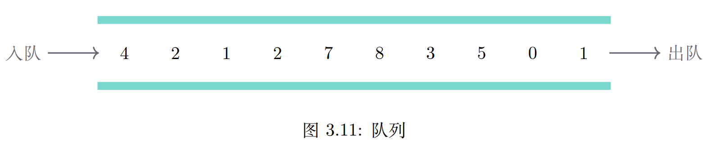
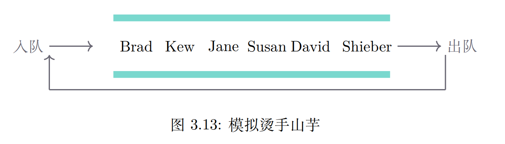

## 队列的抽象数据类型

### 概念

在一端插入(队尾)，在另一端移除(队首)

先进先出(First In First Out, FIFO)

### 操作
- new() 创建一个新队列，无需入参，返回一个空队列
- enqueue(item) 将新项添加到队尾，需item作为入参，不返回任何内容
- dequeue() 从队首移除项，无需入参，返回item，队列被修改
- is_empty() 检查队列是否为空，无需入参，返回布尔值
- size() 返回队列中item的个数，无需入参，返回一个整数

### 操作示意
| No | 队列操作         | 队列当前值       | 操作返回值 |
|----|--------------|-------------|-------|
| 1  | q.is_empty() | []          | true  |
| 2  | q.enqueue(1) | [1]         |       |
| 3  | q.enqueue(2) | [1,2]       |       |
| 4  | q.enqueue(3) | [1,2,3]     |       |
| 5  | q.enqueue(5) | [1,2,3,5]   |       |
| 6  | s.dequeue()  | [2,3,5]     | 1     |
| 7  | s.size()     | [2,3,5]     | 3     |
| 8  | s.is_empty() | [2,3,5]     | false |
| 9  | s.enqueue(4) | [2,3,5,4]   |       |
| 10 | s.enqueue(6) | [2,3,5,4,6] |       |
| 11 | s.dequeue()  | [3,5,4,6]   | 2     |
| 12 | s.size()     | [3,5,4,6]   | 4     |

### 烫手山芋游戏(类似约瑟夫问题)
