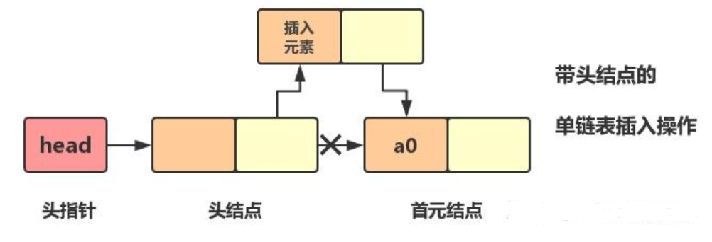
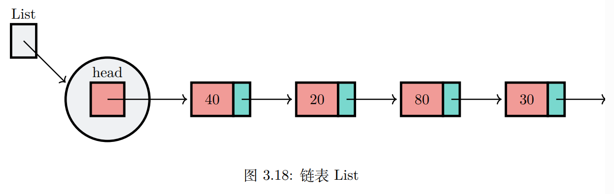

## 链表的抽象数据类型
### 概念

元素不像数组那样保存在连续的内存中

数据项依然有序

### 操作
- new() 创建一个新的头结点用于指向Node，无需入参，返回指针
- push(item) 添加一个新的Node，需item作为入参，返回Node
- pop() 删除链表头节点，无需入参，返回Node
- peek() 返回链表头结点，无需入参，返回对值的引用
- peek_mut() 返回链表头结点，无需入参，返回对值的可变引用
- into_iter() 改变链表为可迭代形式，无需入参
- iter() 返回链表不可变迭代形式，链表不变，无需入参
- iter_mut() 返回链表可变迭代形式，链表不变，无需入参
- is_empty() 判断链表是否为空，无需入参，返回布尔值
- size() 返回链表的长度，无需入参，返回一个usize型整数

### 操作示意
| No | 链表操作          | 链表当前值           | 操作返回值       |
|----|---------------|-----------------|-------------|
| 1  | l.is_empty()  | [None->None]    | true        |
| 2  | l.push(1)     | [1->None]       |             |
| 3  | l.push(2)     | [2->1->None]    |             |
| 4  | l.push(3)     | [3->2->1->None] |             |
| 5  | l.peek()      | [3->2->1->None] | Link<3>     |
| 6  | l.pop()       | [2->1->None]    | 3           |
| 7  | l.size()      | [2->1->None]    | 2           |
| 8  | l.push(4)     | [4->2->1->None] |             |
| 9  | l.peek_mut()  | [4->2->1->None] | mut Link<4> |
| 10 | l.iter()      | [4->2->1->None] | [4,2,1]     |
| 11 | l.is_empty()  | [4->2->1->None] | false       |
| 12 | l.into_iter() | [4->2->1->None] | [4,2,1]     |

### 可以用链表实现栈
