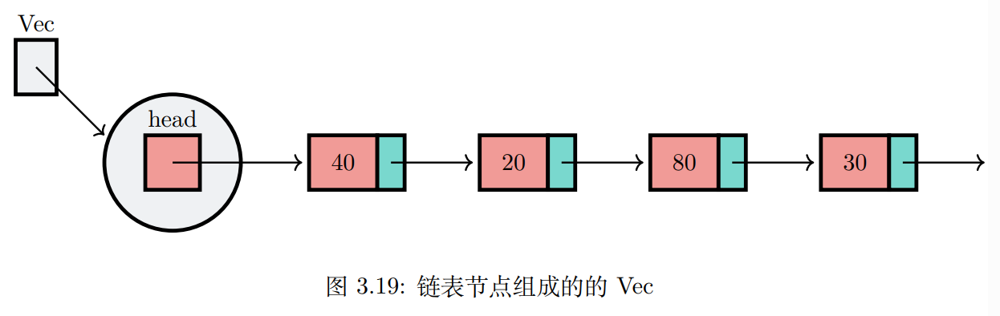

## 动态数组的抽象数据类型
### 概念

Vec是Rust自带的数据容器，默认实现用的是动态数组，本节用的是单链表

### 操作
- new() 创建一个新的Vec，无需入参，返回一个空Vec
- push(item) 将数据项item添加到Vec末尾，需item作为入参，不返回任何值
- pop() 删除Vec末尾的数据项，无需入参，返回删除的项
- insert(pos, item) 在Vec的pos处插入项，需pos和item作为入参，不返回任何值
- remove(index) 删除Vec中第index项，需index作为入参，返回删除的项
- find(item) 在Vec中查看item项是否存在，需item作为入参，返回一个i32整数，如果存在则返回index(>=0)，如果不存在返回-1
- exist(item) 在Vec中查看item项是否存在，需item作为入参，返回一个布尔值
- is_empty() 判断Vec是否为空，无需入参，返回布尔值
- size() 返回Vec中数据项的个数，无需入参，返回一个usize型整数

### 操作示意
| No | 动态数组操作        | 动态数组当前值 | 操作返回值 |
|----|---------------|---------|-------|
| 1  | s.is_empty()  | []      | true  |
| 2  | s.push(1)     | [1]     |       |
| 3  | s.push(2)     | [1,2]   |       |
| 4  | s.size()      | [1,2]   | 2     |
| 5  | s.pop()       | [1]     | 2     |
| 6  | s.push(5)     | [1,5]   |       |
| 7  | s.find(4)     | [1,5]   | false |
| 8  | s.insert(0,8) | [8,1,5] |       |
| 9  | s.remove(0)   | [1,5]   | 8     |

