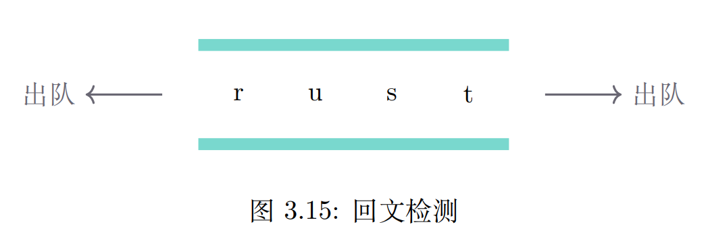

## 双端队列的抽象数据类型

### 概念

有2个端部(首端和尾端)，每个端都可以添加或删除项

### 操作
- new() 创建一个新的双端队列，无需入参，返回空的双端队列
- add_front(item) 将项item添加到双端队列的首部，需item作为入参，不返回任何内容
- add_rear(item) 将项item添加到双端队列的尾部，需item作为入参，不返回任何内容
- remove_front() 从双端队列的首部删除首项，无需入参，返回item。双端队列被修改
- remove_rear() 从双端队列的尾部删除尾项，无需入参，返回item。双端队列被修改
- is_empty() 判断双端队列是否为空，无需入参，返回布尔值
- size() 返回双端队列中item的个数，无需入参，返回一个整数

### 操作示意
| No | 双端队列操作           | 双端队列当前值   | 操作返回值 |
|----|------------------|-----------|-------|
| 1  | d.is_empty()     | []        | true  |
| 2  | d.add_rear(1)    | [1]       |       |
| 3  | d.add_rear(2)    | [2,1]     |       |
| 4  | d.add_front(3)   | [2,1,3]   |       |
| 5  | d.add_front(4)   | [2,1,3,4] |       |
| 6  | d.size()         | [2,1,3,4] | 4     |
| 7  | d.is_empty()     | [2,1,3,4] | false |
| 8  | d.remove_rear()  | [1,3,4]   | 2     |
| 9  | d.remove_front() | [1,3]     | 4     |
| 10 | d.size()         | [1,3]     | 2     |

### 回文检测
