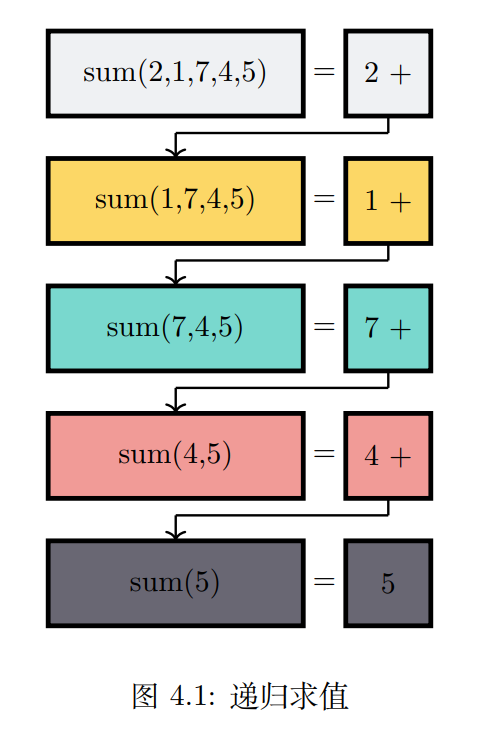
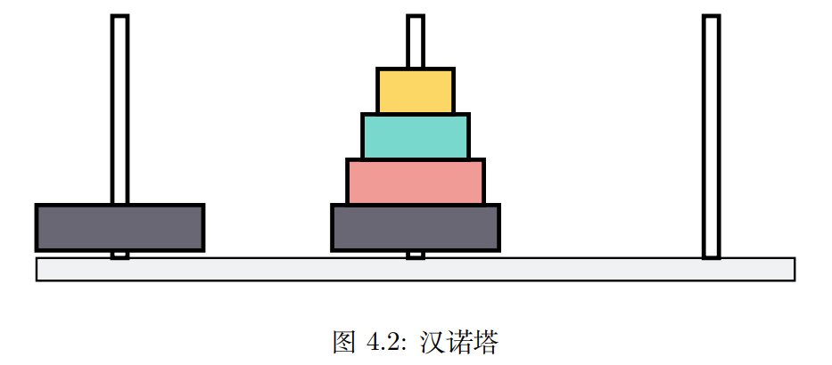
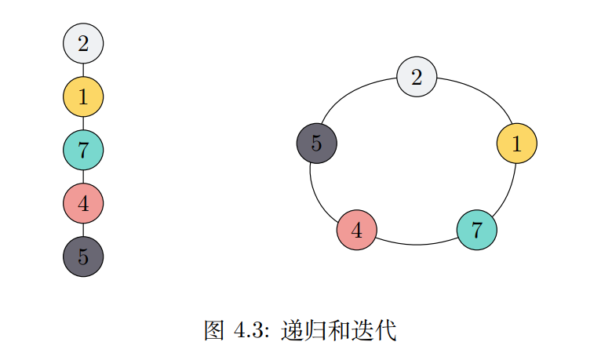

# 递归

## 本章目标
- 要理解简单的递归解决方案
- 学习如何用递归写出程序
- 理解和应用递归三个定律
- 将递归理解为一种迭代形式
- 将问题公式化地实现成递归
- 了解计算机如何实现递归

## 什么是递归
> 递归是一种解决问题的方法，通过将问题分解为更小的子问题，直到得到一个足够小的基本问题。
> 这个基本问题可以被很简单地解决，再通过合并基本问题的结果得到大问题的结果。


 
### 举例说明
计算整数[2, 1, 7, 4, 5]的总和

#### 迭代版
> 2 + 1 + 7 + 4 + 5

```rust
pub fn nums_sum(nums: Vec<i32>) -> i32 {
    let mut sum = 0;
    
    for num in nums {
        sum += num;
    }
    
    sum
}
```

#### 递归版
##### Sum(nums) = Sum(restL(nums)) + Last(nums)
>               sum = ((((2 + 1) + 7) + 4) + 5)   
>               sum =       (((3 + 7) + 4) + 5)   
>               sum =            ((10 + 4) + 5)   
>               sum =                  (14 + 5)   
>               sum =                        19

```rust
pub fn nums_sum2(nums: &[i32]) -> i32 {
    if nums.len() == 1 {
        return nums[0];
    }

    let last = nums[nums.len() - 1];
    nums_sum2(&nums[..nums.len() - 1]) + last
}
```
##### Sum(nums) = First(nums) + Sum(restR(nums))
>               sum = (2 + (1 + (7 + (4 + 5))))   
>               sum = (2 + (1 + (7 + 9)))   
>               sum = (2 + (1 + 16))   
>               sum = (2 + 17)   
>               sum = 19

```rust
pub fn nums_sum1(nums: &[i32]) -> i32 {
    if nums.len() == 1 {
        return nums[0];
    }

    let first = nums[0];
    first + nums_sum1(&nums[1..])
}
```

### 递归三定律
1. 递归算法必须具有基本情况
2. 递归算法必须向基本情况靠近
3. 递归算法必须以递归方式调用自身

### 到任意进制的转换
1. 将原始数字简化为一系列单个数字
2. 使用查找法将单个数字转换为字符
3. 将单个字符连接在一起以形成最终结果

可以把递归看成是栈

### 汉诺塔


1. 借助目标杆将 height-1 个盘子移动到中间杆
2. 将最后一个盘子移动到目标杆
3. 借助起始杆将 height-1 个盘子从中间杆移动到目标杆


## 尾递归
普通递归可能存在爆栈的情况

### 递归和迭代

> 递归：用来描述以自相似方法重复事务的过程，在数学和计算机科学中，指的是在函数定义中使用函数自身的方法
> 
> 递归调用展开的话，是一个类似树的结构。从字面意思可以理解为重复递推和回溯的过程，当递推到达底部时就会开始回溯，其过程相当于树的深度优先遍历


> 迭代：重复反馈过程的活动，每一次迭代的结果会作为下一次迭代的初始值
> 
> 迭代是一个环结构，从初始状态开始，每次迭代都遍历这个环，并更新状态，多次迭代直到结束状态
 
> 所有的迭代都可以转换为递归，但递归不一定可以转换成迭代。
> 毕竟环改成树一定可以，但树改成环却未必能行


## 动态规划
> 动态规划（dynamic programming，DP）是运筹学的一个分支，是求解决策过程最优化的数学方法
> 
> 动态规划从小问题推导到大问题，推导过程的中间值要缓存起来，这个推导过程称为状态转移
> 
> 动态规划的代码是迭代

> 递归是一种调用自身，通过分解大问题为小问题以解决问题的技术
> 
> 动态规划则是一种利用小问题解决大问题的技术
> 
> 递归费栈，容易爆内存。动态规划则不好找准转移规则和起始条件

## 总结
> 在本章中我们讨论了递归算法和迭代算法。所有递归算法都必须要满足三定律，递归在
> 某些情况下可以代替迭代，但迭代不一定能替代递归。递归算法通常可以自然地映射到所解
> 决的问题的表达式，看起来很直观简洁。递归并不总是好的方案，有时递归解决方案可能比
> 迭代算法在计算上更昂贵。尾递归是递归的优化形式，能一定程度上减少栈资源使用。动态
> 规划可用于解决最优化问题，通过小问题逐步构建大问题，而递归是通过分解大问题为小问
> 题来逐步解决。