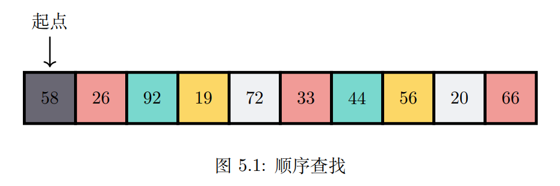

# 搜索/查找

## 本章目标
- 能够实现顺序查找，二分查找
- 理解哈希作为查找技术的思想
- 使用 Vec 实现 HashMap 抽象数据类型


## 顺序查找
#### 概念
> 从第一个项目开始，按照顺序从一个项移动到另一个项，直到找到目标所在项或遍历完整个集合



#### 复杂度
| /     | 最少比较次数 | 平均比较次数 | 最多比较次数 | 查找类型 |
|-------|--------|--------|--------|------|
| 目标存在  | 1      | n/2    | n      | 无序查找 |
| 目标不存在 | n      | n      | n      | 无序查找 |
| 目标存在  | 1      | n/2    | n      | 有序查找 |
| 目标不存在 | 1      | n/2    | n      | 有序查找 |

## 二分查找
#### 概念


#### 复杂度
O(*log*2(n))

### 内插查找
> 内插查找是一种二分查找的变形，适合在排序数据中进行查找

```text
    y - y0     y1 - y0
    ------  =  -------
    x - x0     x1 - x0
    
               (y - y0)(x1 - x0)
    =>   x  =  ----------------- + x0
                    y1 - y0
```
#### 复杂度
| / | 最好             | 平均   | 最差   |
|---|----------------|------|------|
| 1 | O(*loglog*(n)) | O(n) | O(n) |


### 指数查找
> 指数查找是另一种二分查找的变体，它划分中值的方法不是使用平均或插值而是用指数函数来估计
> 
> 该算法在查找过程中不断比较 2^0, 2^1, 2^2, 2^k 位置上的值和目标值的关系，进而确定搜索区域，之后在该区域内使用二分查找算法查找

#### 复杂度
O(*log*2(n))


## 哈希查找
#### 概念
> 通过数据项直接获得其保存地址的方法称为哈希查找(Hash Search)
> 
> 数据项及其在哈希表中所属槽之间的映射关系被称为 hash 函数或散列函数
> 
> hash 函数接收集合中的任何项，并返回具体的槽名，这个动作称为哈希或散列


#### 解决冲突
- 开放寻址法
  - 线性探测法

  - 平方探测法

- 拉链法


#### HashMap的抽象数据类型
- new() 创建一个新的HashMap，无需入参，返回一个空的HashMap集合
- insert(k, v) 向HashMap中添加一个新的键值对，需入参k、v，如果键已存在，那么用新值v替换旧值
- remove(k) 从HashMap中删除某个k，需入参k，返回k对应的v
- get(k) 查找k对应的值v(可能为空None)，需入参k
- contains(k) 如果键k存在，则返回true，否则返回false，需入参k
- len() 返回存储在HashMap中的键值对数量，无需入参

#### HashMap复杂度
最好的情况是O(1)

## 总结
>    本章我们学习了查找算法，包括顺序查找，二分查找和哈希查找。顺序查找是最简单和
> 直观的查找算法，其复杂度为 O(n)，二分查找算法每次都去掉一半数据，速度比较快，但要
> 求数据集有序，复杂度为 O(log2(n))。基于二分查找衍生了类似内插查找和指数查找这样的
> 算法，它们适合的数据分布类型不同。哈希查找是利用 HashMap 实现的一种 O(1) 查找算
> 法，要注意的是哈希表容易冲突，需要采取合理措施解决冲突，比如开放寻址法、拉链法。
