## 本章目标
- 学习了解排序思想
- 能用Rust实现十大基本排序算法

## 什么是排序
> 排序是以某种顺序在集合中放置元素的过程
> 
> 排序算法的核心操作是比较
> 
> 评价排序算法除了时间空间复杂度，还要看稳定性

## 冒泡排序
#### 概念
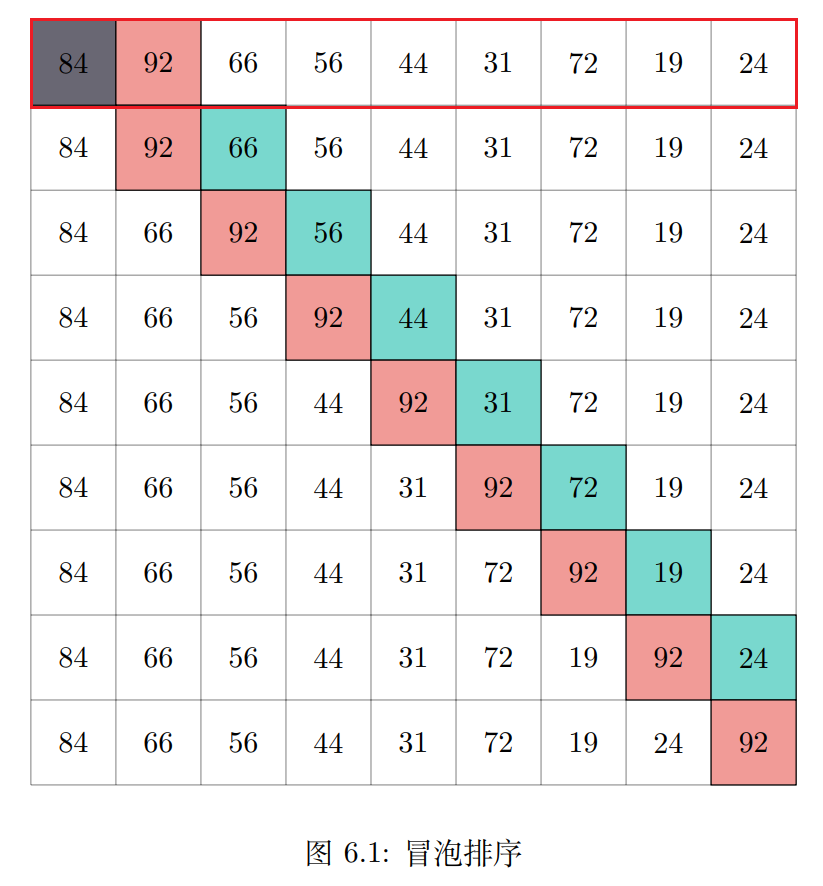

#### 复杂度
O(n^2)

#### 变体
- 鸡尾酒排序(n^2)
- 梳排序(nlogn, 不稳定)
- CBICS(n^2)


## 快速排序
#### 概念
> 快速排序和冒泡排序有相似之处，应该说快速排序是冒泡排序的升级版
> 
> 快速排序使用分而治之的策略来加快排序速度，这又和二分思想、递归思想有些类似
> 
> 快速排序只有两个步骤，一是选择中枢值，二是分区排序
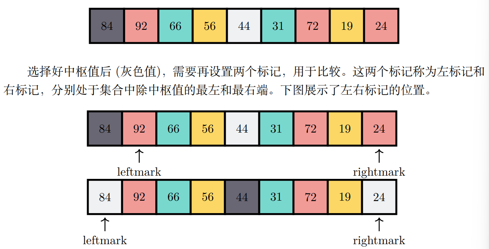

#### 复杂度
最好O(nlog2(n))，最坏O(n^2)


## 插入排序
#### 概念
> 始终在数据集的较低位置处维护一个有序的子序列，然后将新项插入子序列，使得子序列扩大，最终实现集合排序
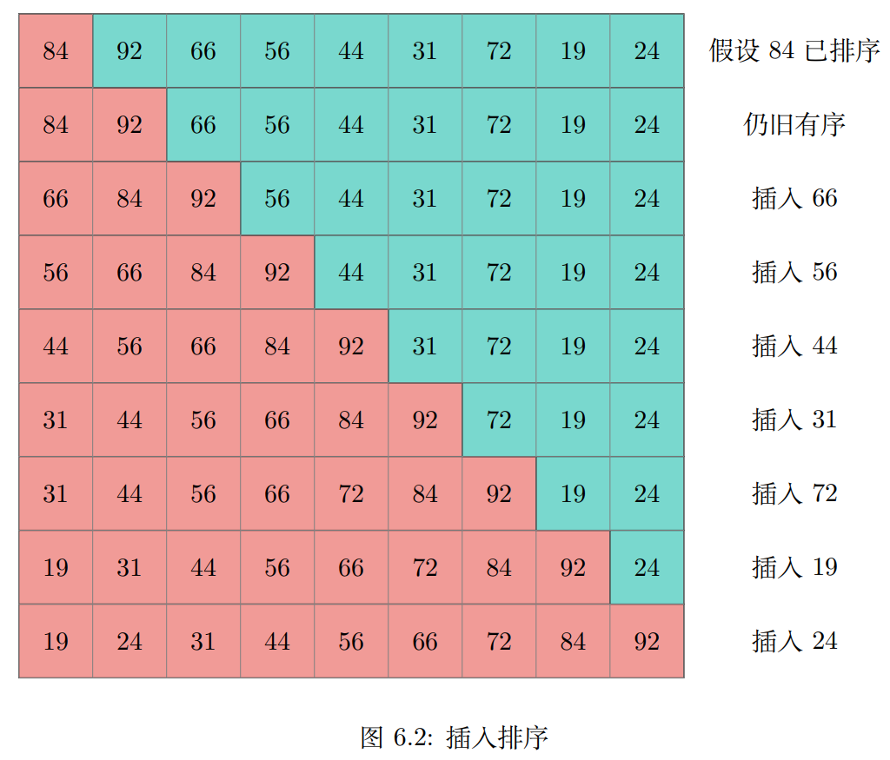

#### 复杂度
O(n^2)


## 希尔排序
#### 概念
> 希尔排序，也称递减递增排序。它将原始集合分为多个较小的子集合，然后对每个集合运用插入排序
> 
> 选择子集合的方式是希尔排序的关键
> 
> 希尔排序不是将集合均匀拆分为连续项的子列表，而是隔几个项选择一个项加入子集合，隔开的距离称为增量 gap
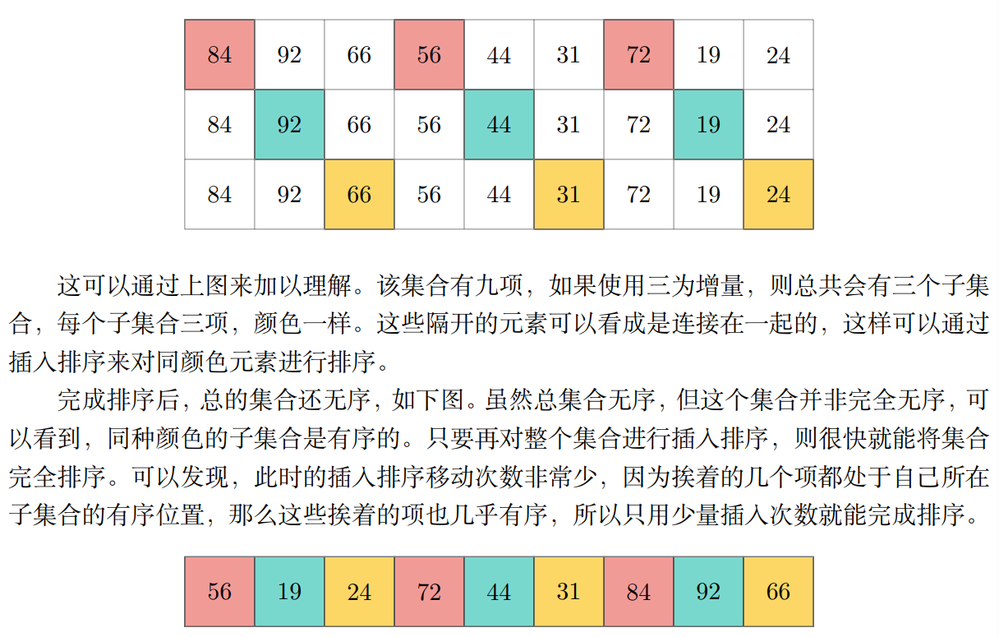

#### 复杂度
O(n)-O(n^2)


## 归并排序
#### 概念
> 归并排序和快速排序都是一种分而治之的递归算法，通过不断将列表折半来进行排序
> 
> 如果集合为空或只有一个项，则按基本情况进行排序
> 
> 如果有多项，则分割集合，并递归调用两个区间的归并排序
> 
> 一旦对这两个区间排序完成，就执行合并操作
> 
> 合并是获取两个子排序集合并将它们组合成单个排序新集合的过程
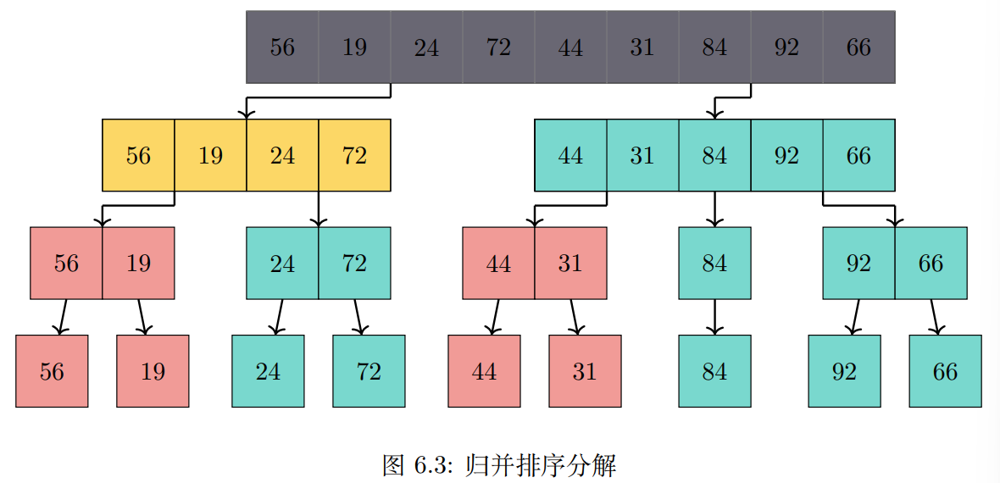
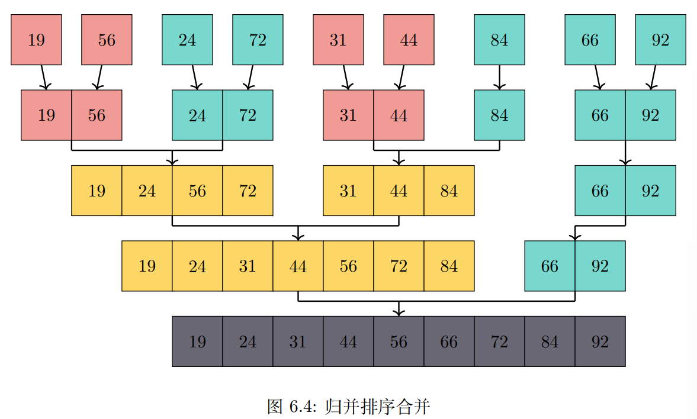

#### 复杂度
O(nlog2(n))


## 选择排序
#### 概念
> 选择排序是对冒泡排序的改进，每次遍历集合只做一次交换
> 选择排序在遍历时只寻找最大值的下标，并在完成遍历后，将该最大项交换到正确的位置
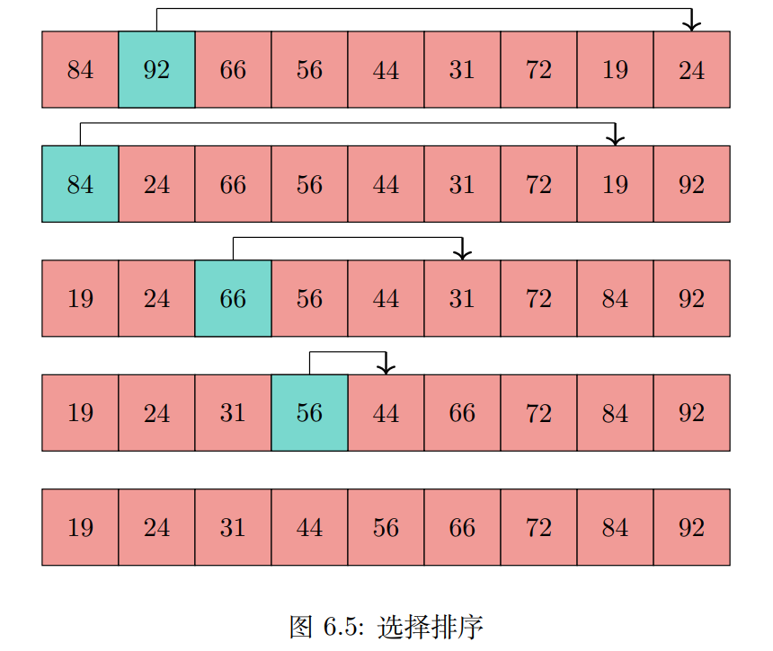

#### 复杂度
O(n^2)


## 堆排序
#### 概念
> 堆排序是利用堆数据结构设计的一种排序算法，是一种选择排序，通过不断选择顶元素到末尾，然后再重建堆实现排序
> 
> 它是不稳定排序
> 
> 小顶堆得到的是降序排序，大顶堆得到的是升序排序
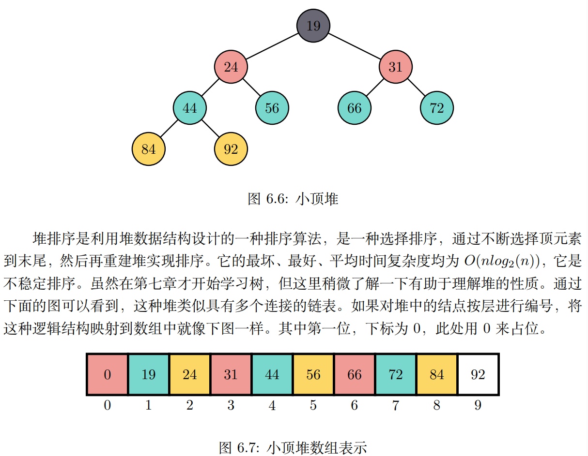

#### 复杂度
O(nlog2(n))


## 桶排序
#### 概念
> 非比较算法主要是桶排序，计数排序，基数排序
> 
> 非比较排序通过确定每个元素之前有多少个元素存在来排序
> 
> 非比较排序只要确定每个元素之前的已有的元素个数即可
> 
> 由于非比较排序需要占用额外空间来确定位置，所以对数据规模和数据分布有一定的要求
> 
> 非比较排序只适合特殊数据(尤其是数字)的排序

#### 桶排序的基本思路
```text
第一步,将待排序元素划分到不同的桶,先遍历求出maxV和minV,设桶个数为k,则把区间[minV, maxV]均匀划分成k个区间,每个区间是一个桶,将序列中的元素分配到各自的桶(求余法)

第二步,对每个桶内的元素进行排序,排序算法可用任意排序算法

第三步,将各个桶中的有序元素合并成一个大的有序集合
```
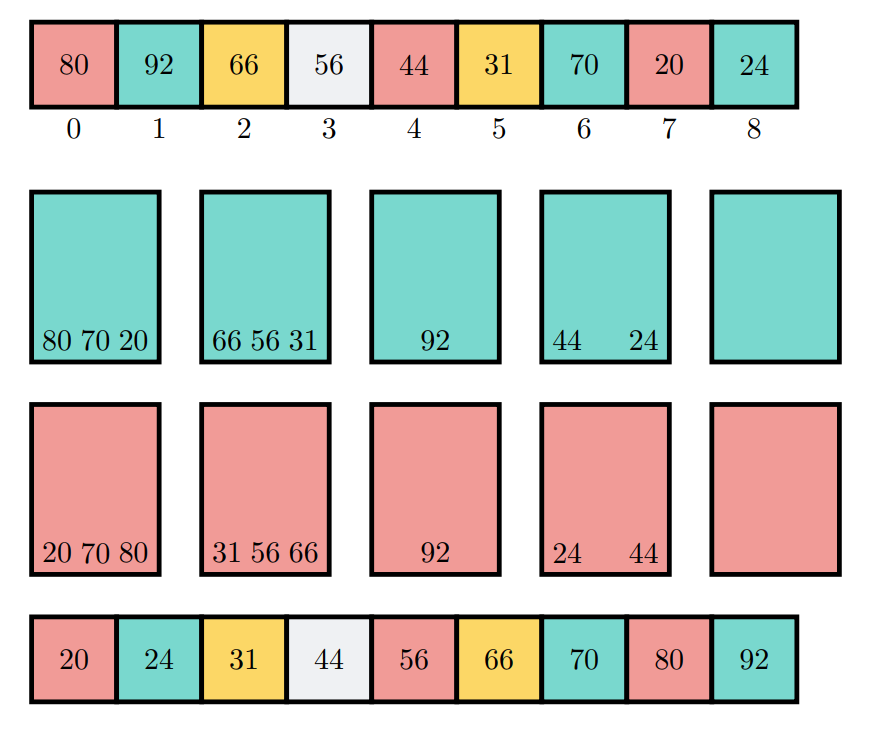

#### 复杂度
O(n)


## 计数排序
#### 概念
> 计数排序是桶排序的特殊情况，它的桶就只处理同种数据

#### 计数排序的基本思路
```text
第一步，初始化长度为maxV - minV + 1的计数器集合，值为0，其中maxV为待排序集合的最大值，minV为最小值

第二步，扫描待排序集合，以当前值减minV作下标，并对计数器中此下标的计数加1

第三步，扫描一遍计数器集合，按顺序把值写回原集合，完成排序
```

#### 复杂度
O(n)


## 基数排序
#### 概念
> 基数排序也是非比较排序，它利用正数的进制规律来排序

#### 基本思路
```text
第一步，找到nums中最大值，得到位数，将数据统一为相同位数不够补零
第二步，从最低位开始，依次进行稳定排序，收集，再排序高位直到排序完成 
```
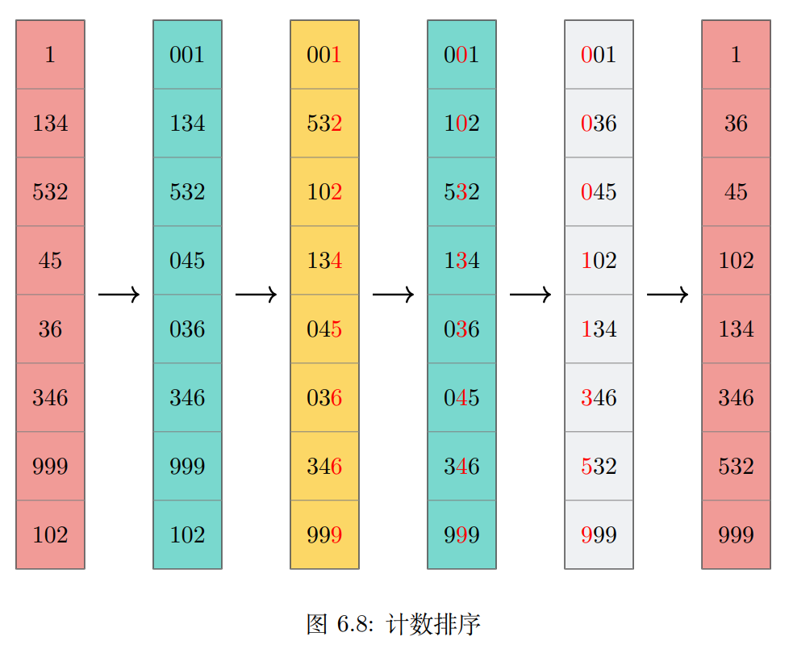

#### 复杂度
O(n^2)

#### 联系
```text
   综合来看，三个非比较排序是相互有关系的。计数排序是桶排序的特殊情况，基数排序
若采用最少的位来排，则此时也退化成计数排序。所以基数排序和计数排序都可以看作是桶
排序，计数排序是桶取最大值时的桶排序，基数排序是每个数位上的桶排序，是多轮桶排序。
当用最大值作基数时，基数排序退化成计数排序。桶排序适合元素分布均匀的场景，计数排
序要求 maxV 和 minV 差距小，基数排序只能处理正数，也要求 maxV 和 minV 尽可能接
近。所以，这三个排序只能排序少量的数据，最好总量小于 10000。

```

## 蒂姆排序
#### 概念
> Tim Peters在2002年提出了TimSort
> 
> 该排序算法高效，稳定且自适应数据分布，比大多数排序算法都优秀
> 
> TimSort是一种混合的排序算法，结合了归并和插入排序
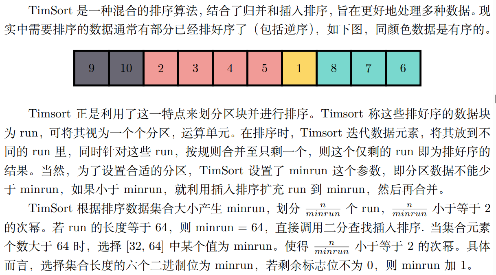

#### 复杂度


## 总结
```text
本章学习了十类排序算法。冒泡及选择排序和插入排序是 O(n^2) 算法，其余排序算法的
复杂度多是 O(nlog2(n))。选择排序是对冒泡排序的改进，希尔排序是对插入排序的改进，堆
排序是对选择排序的改进，快速排序和归并排序均利用分而治之的思想。这些排序都是通过
比较来排序，还有不需要比较只依靠数值规律而排序的算法，这类排序算法是非比较排序算
法，分别有桶排序、计数排序、基数排序。它们的复杂度都是 O(n) 左右，适合少量数据排序。
计数排序是特殊的桶排序，基数排序是多轮桶排序，基数排序可以退化成计数排序。除了基
础排序算法，本章还学习了部分算法的改进版，尤其是蒂姆算法，是高效稳定的混合排序算
法，其改进版已经是许多语言和平台的默认排序算法。
```
| /  | 排序算法 | 最差复杂度      | 最优复杂度      | 平均复杂度      | 空间复杂度      | 稳定性 | 综合类别  |
|----|------|------------|------------|------------|------------|-----|-------|
| 1  | 冒泡排序 | O(n^2)     | O(n)       | O(n^2)     | O(1)       | 稳定  | 交换比较类 |
| 2  | 快速排序 | O(n^2)     | O(nlog(n)) | O(nlog(n)) | O(nlog(n)) | 不稳定 | 交换比较类 |
| 3  | 选择排序 | O(n^2)     | O(n^2)     | O(n^2)     | O(1)       | 不稳定 | 选择比较类 |
| 4  | 堆排序  | O(nlog(n)) | O(nlog(n)) | O(nlog(n)) | O(1)       | 不稳定 | 选择比较类 |
| 5  | 插入排序 | O(n^2)     | O(n)       | O(n^2)     | O(1)       | 稳定  | 插入比较类 |
| 6  | 希尔排序 | O(n^2)     | O(n)       | O(n^1.3)   | O(1)       | 不稳定 | 插入比较类 |
| 7  | 归并排序 | O(nlog(n)) | O(nlog(n)) | O(nlog(n)) | O(n)       | 稳定  | 分治比较类 |
| 8  | 计数排序 | O(n+k)     | O(n+k)     | O(n+k)     | O(n+k)     | 稳定  | 非比较类  |
| 9  | 桶排序  | O(n^2)     | O(n)       | O(n+k)     | O(n+k)     | 稳定  | 非比较类  |
| 10 | 基数排序 | O(nk)      | O(nk)      | O(nk)      | O(n+k)     | 稳定  | 非比较类  |
