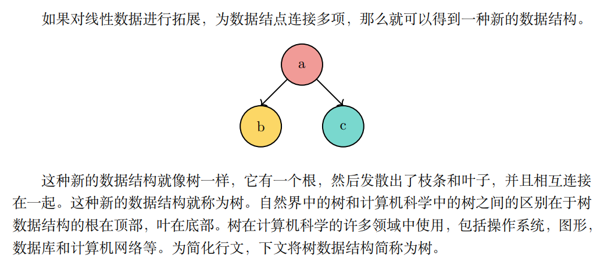
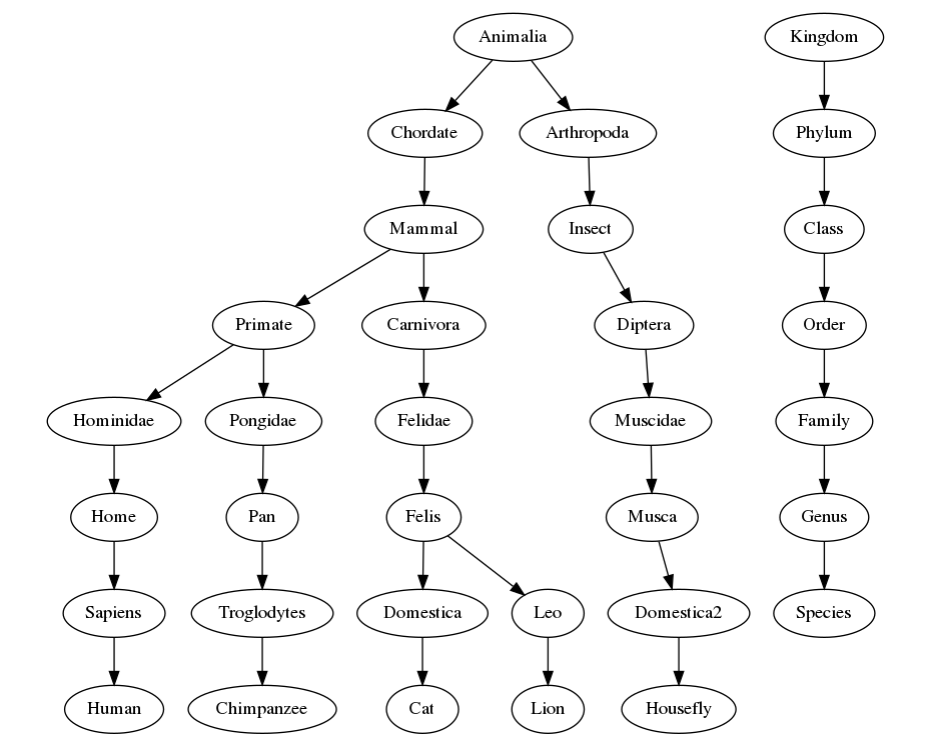
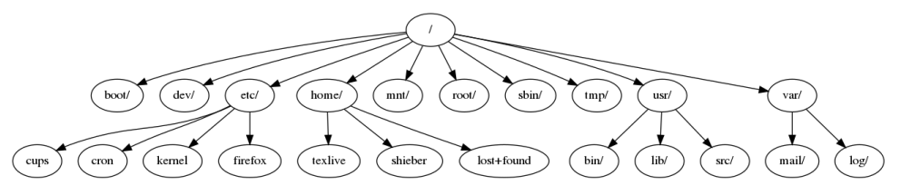
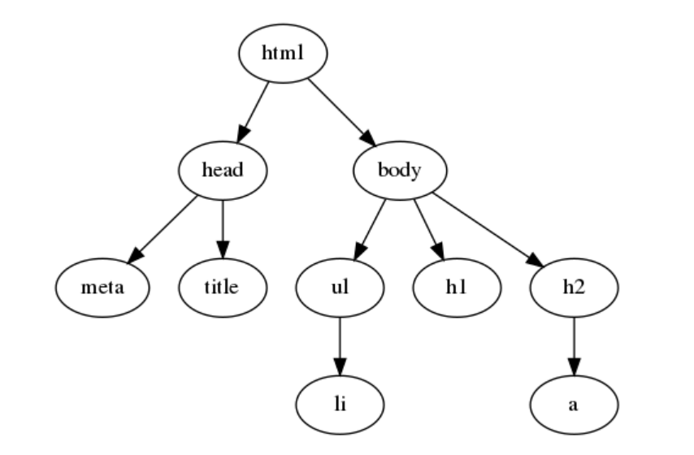
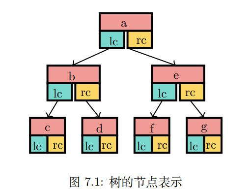
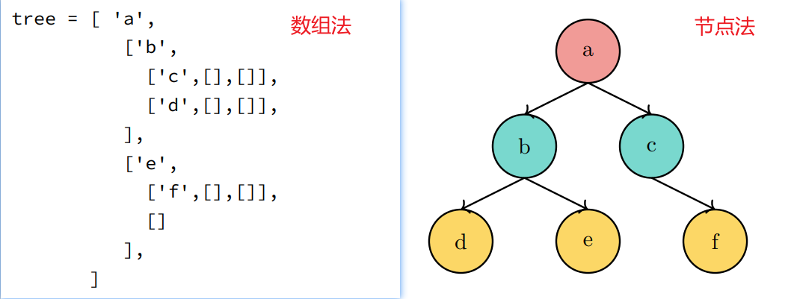
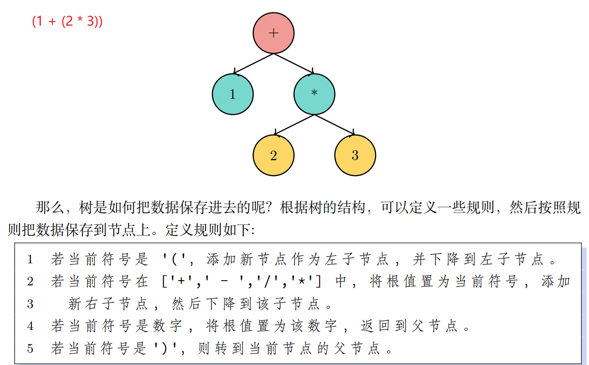

## 什么是树
### 概念及示例

### 特点
1. 树是分层的
2. 一个节点的所有子节点独立于另一个节点的子节点
3. 每个叶节点是唯一的
4. 树的结构是递归的

### 属性
- 节点: 节点是树的基本部分，它还有一个名称叫做"键"。节点也可以有附加信息，附加信息称为"有效载荷"。比如树节点上存储时间，文件名等。
- 根: 根是树中唯一没有传入边的节点，它处于顶层，所有的节点都可以从根找到，类似操作系统的 / 或 C 盘这样的概念。
- 边: 边是树的另一个基本部分，又叫分支。边连接两个节点以保持之间存在的关系。每个节点，除根之外，都恰好有一个输入边和若干输出边。边就是路径，可以通过它来找到某个节点的具体位置。
- 路径: 路径是由边连接节点的有序序列，它本身并不存在，是由其逻辑结构涌现出来的一种信息。比如 /home/user/files/sort.rs 就是一条路径，它标识了 sort.rs 这个文件的具体位置。
- 子节点: 子节点是某个节点的下一级，所有子节点都源自同一个上层节点。子节点不唯一，可以存在零个、一个、多个子节点。
- 父节点: 父节点是所有下级节点的源，所有子节点都源自同一个父节点。父节点唯一。
- 子树: 子树是由父节点和该父节点的所有后代组成的一组节点和边。
- 叶节点: 叶节点是没有子节点的节点，处于最底层。
- 中间节点: 中间节点有子节点，有父节点。
- 层数: 节点n的层数为从根到该结点所经过的分支数目。根节点的层数为零。层数为零不代表没有层数，而是层数就是零，是第零层。
- 高度: 树的高度等于树中任何节点的最大层数。

### 定义
1. 树具有一个根节点
2. 除根节点外，每个节点通过其他节点的边互相连接父和子节点(若有)
3. 从根遍历到任何节点的路径全局唯一

### 表示
1. 数组法(如果树较大，则嵌套太深且复杂)
2. 节点法

### 分析树

### 树的遍历
- 前序遍历: 先查看根节点，然后左子树，最后右子树 - 根左右
- 中序遍历: 先查看左子树，然后根节点，最后右子树 - 左根右
- 后序遍历: 先查看左子树，然后右子树，最后根节点 - 左右根

| 序 | 遍历方法   | 遍历顺序 | 镜像遍历顺序 | 镜像遍历方法 |
|---|--------|------|--------|--------|
| 1 | 前序遍历   | 根左右  | 根右左    | 前序镜像遍历 |
| 2 | 中序遍历   | 左根右  | 右根左    | 中序镜像遍历 |
| 3 | 后序遍历   | 左右根  | 右左根    | 后序镜像遍历 |
| 4 | 前序镜像遍历 | 根右左  | 根左右    | 前序遍历   |
| 5 | 中序镜像遍历 | 右根左  | 左根右    | 中序遍历   |
| 6 | 后序镜像遍历 | 右左根  | 左右根    | 后序遍历   |
