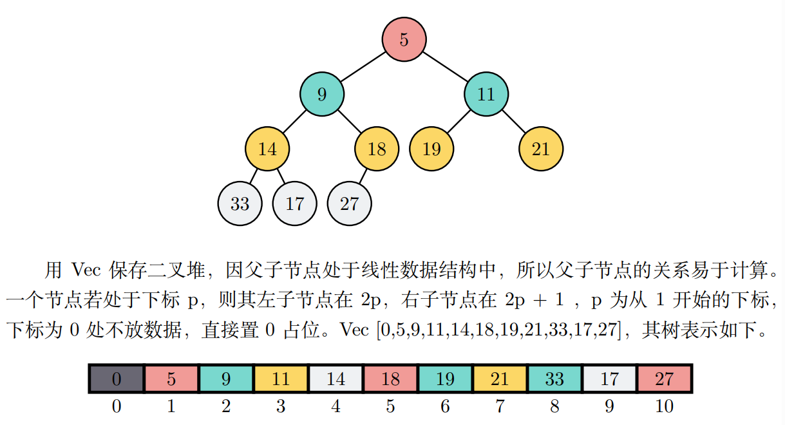
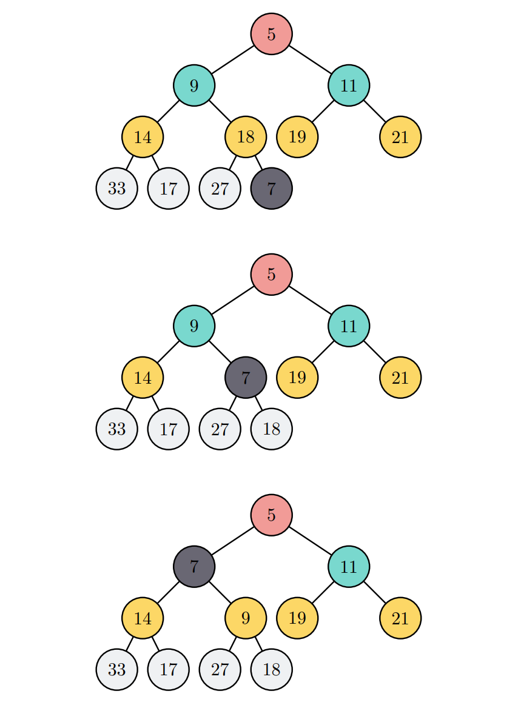
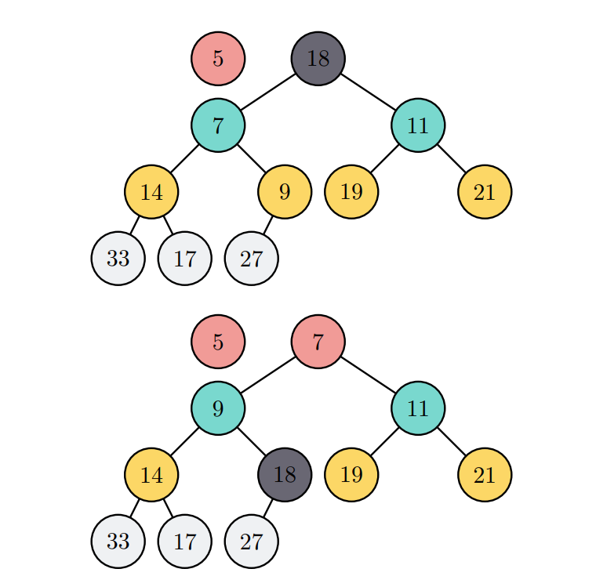

## 基于二叉堆的优先队列
### 特点
- 在优先级队列中，项的顺序不是按照从末尾加入的顺序，而是由数据项的优先级确定
- 最高优先级项在队列的首部，最先出队
- 在将新项加入优先级队列时，如果新项的优先级够高，那么它会一直往队首移动
- 二叉堆有两种常见的形态: 大顶堆和小顶堆

### 二叉堆操作
- new() 创建一个新的二叉堆，无需入参，返回空堆
- push(k) 向堆内添加一新项，需k作为入参，不返回任何内容
- pop() 返回堆的最小项，从堆中删除该项，无需入参
- min() 返回堆的最小项，不修改堆，无需入参
- size() 返回堆中的项数，无需入参，返回usize型整数
- is_empty() 判空，无需入参，返回布尔值
- build(arr) 以数组或vec构建新堆，需入参arr

### 二叉堆操作示意(以小顶堆为例)
| No | 堆操作            | 堆当前值      | 操作返回值 |
|----|----------------|-----------|-------|
| 1  | h.is_empty()   | []        | true  |
| 2  | h.push(8)      | [8]       |       |
| 3  | h.push(6)      | [6,8]     |       |
| 4  | h.min()        | [6,8]     | 6     |
| 5  | h.push(3)      | [3,8,6]   |       |
| 6  | h.size()       | [3,8,6]   | 3     |
| 7  | h.is_empty()   | [3,8,6]   | false |
| 8  | h.push(4)      | [3,4,6,8] |       |
| 9  | h.min()        | [3,4,6,8] | 3     |
| 10 | h.pop()        | [4,8,6]   | 3     |
| 11 | h.pop()        | [6,8]     | 4     |
| 12 | h.build([1,2]) | [1,2,6,8] |       |

### Rust实现二叉堆

### 小数据上浮

### 大数据下沉

### 二叉堆分析
堆排序的时间复杂度为O(nlog2(n))   
二叉堆的高度: ⌊log2(n)⌋, 其中根节点的高度为0
