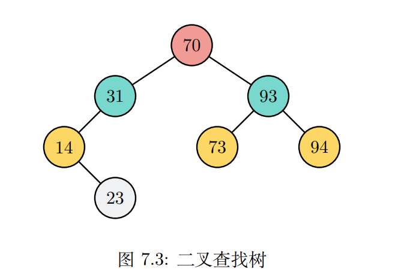
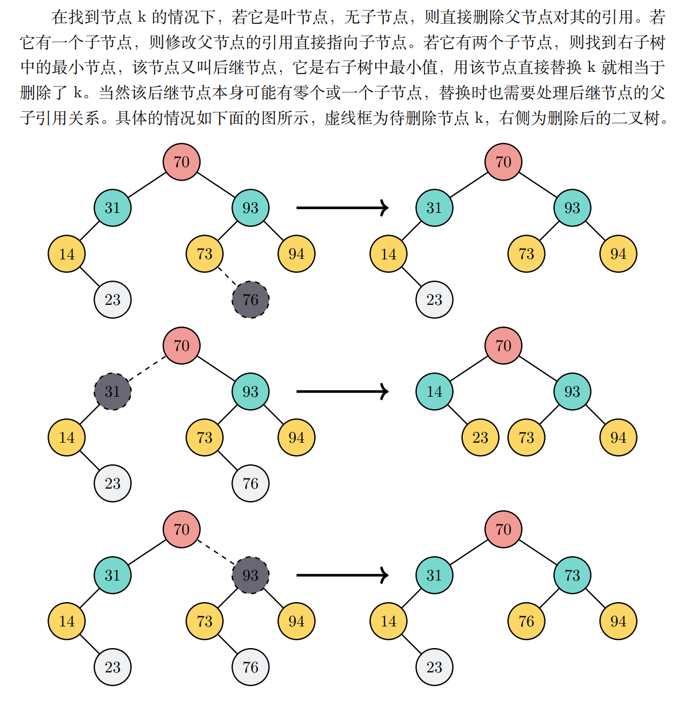
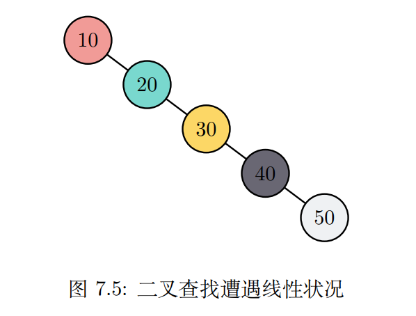

## 二叉查找树
### 概念
二叉树: 只有两个子节点，这种树被称为二叉树   
二叉查找树: 用于查找的二叉树(left < parent < right)

### 二叉树操作
- new() 创建一棵新树，无需入参，返回一颗空树
- insert(k, v) 将数据(k,v)添加到树，需k键、v值作为入参，不返回任何内容
- search(&k) 在树中查找是否包含键k，需键k作为入参，返回布尔值
- get(&k) 从树中返回键k对应的值v，不会删除它，需入参键k
- max() 返回树中最大键k及其值v，无需入参
- min() 返回树中最小键k及其值v，无需入参
- len() 返回树中元素个数，无需入参，返回一个usize型整数
- is_empty() 判空，无需入参，返回布尔值
- iter() 返回树的迭代形式，无需入参，不改变树
- preorder() 前序遍历，无需入参，输出各个k-v键值
- inorder() 中序遍历，无需入参，输出各个k-v键值
- postorder() 后序遍历，无需入参，输出各个k-v键值

### 二叉树操作示意
| No | 二叉树操作           | 二叉树当前值            | 操作返回值               |
|----|-----------------|-------------------|---------------------|
| 1  | t.is_empty()    | []                | true                |
| 2  | t.insert(1,'a') | [(1,'a')]         |                     |
| 3  | t.insert(2,'b') | [(1,'a'),(2,'b')] |                     |
| 4  | t.len()         | [(1,'a'),(2,'b')] | 2                   |
| 5  | t.get(&4)       | [(1,'a'),(2,'b')] | None                |
| 6  | t.get(&2)       | [(1,'a'),(2,'b')] | Some('b')           |
| 7  | t.min()         | [(1,'a'),(2,'b')] | (Some(1),Some('a')) |
| 8  | t.max()         | [(1,'a'),(2,'b')] | (Some(2),Some('b')) |
| 9  | t.search(&2)    | [(1,'a'),(2,'b')] | true                |
| 10 | t.insert(2,'c') | [(1,'a'),(2,'c')] |                     |

### Rust实现二叉查找树
不同于堆的左右子节点不考虑大小关系，二叉查找树左子节点键要小于父节点的键，右子节点的键要大于父节点键，也就是 left < parent < right   
这个规律递归地适用于所有子树

### 删除操作
最复杂的操作：删除节点。删除一个键，首先要找到它。此时树可能存在三种情况：树没有节点、树有一个节点、树有若干节点。针对后两种情况，都需要检查
要删除的节点是否存在。若该节点存在，则此时需要考虑该节点是否有子节点，又有三种情况：该节点是叶节点，该节点有一子节点，该节点有两个子节点。

k节点删除状况:

| 序 | 树节点状况  | k子节点   | 删除方法     |
|---|--------|--------|----------|
| 1 | 无节点    | 无      | 直接返回     |
| 2 | 有1个根节点 | 无      | 直接删除     |
| 3 | 有多个节点  | 无      | 直接删除     |
| 4 | 有多个节点  | 有1个子节点 | 用子节点替换k  |
| 5 | 有多个节点  | 有2个子节点 | 用后继节点替换k |

### 二叉查找树分析
| No | 操作        | 时间复杂度      |
|----|-----------|------------|
| 1  | search    | O(log2(n)) |
| 2  | insert    | O(log2(n)) |
| 3  | remove    | O(log2(n)) |
| 4  | get       | O(log2(n)) |
| 5  | preorder  | O(n)       |
| 6  | inorder   | O(n)       |
| 7  | postorder | O(n)       |
| 8  | len       | O(n)       |
如果插入的数据一直处于有序状态，那么树会退化成线性链表，此时 search、insert、remove 的性能均为 O(n)

