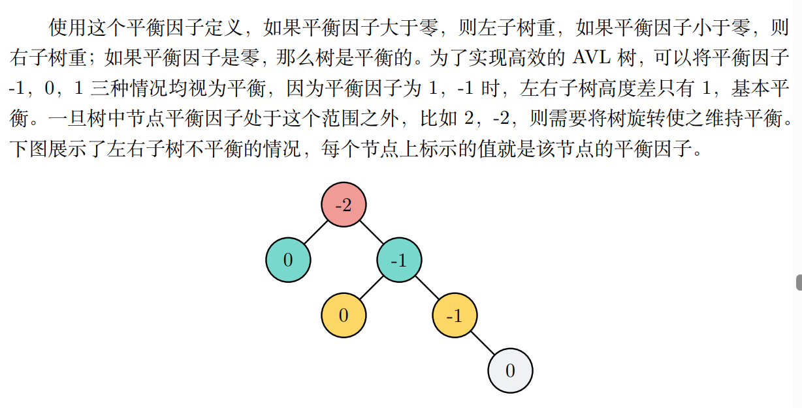
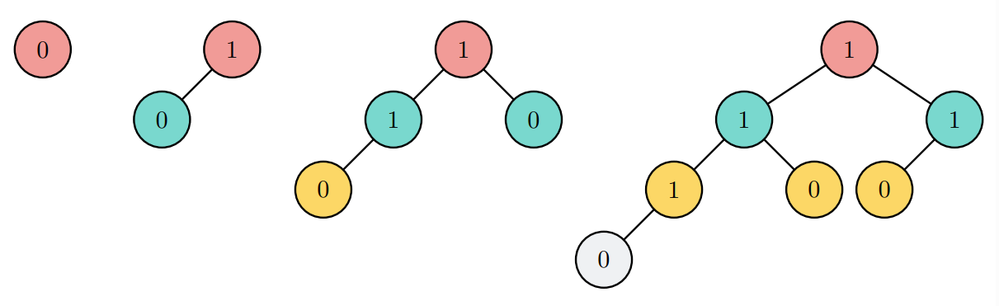
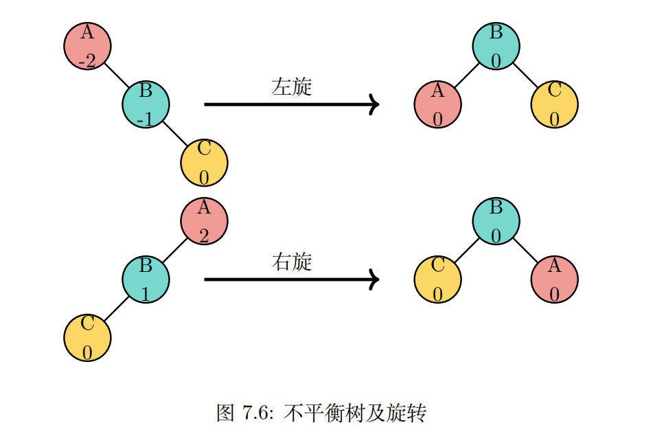

## 平衡二叉树
### 概念
对于二叉查找树，其性能在某些特殊情况可能降级到O(n)。比如树不平衡，一侧有非常多节点，而另一侧几乎没有，则其性能会退化，导致后续操作都非常低效。
而平衡二叉树在二叉查找树的基础上实现自动保持平衡状态。

这种平衡的二叉查找树称为 AVL 树，名字来源于其发明人：G.M. Adelson-Velskii 和 E.M.Land。

平衡因子是节点左右子树高度差，其定义为：balanceFactor = height(leftSubTree) − height(rightSubTree)

### 旋转

要执行左旋转，要执行的操作如下：
1. 提升右孩子 (B) 为子树的根。
2. 将旧根 (A) 移动为新根的左子节点。 
3. 如果新根 (B) 已经有一个左孩子，那么使它成为新左孩子 (A) 的右孩子。

要执行右旋转，要执行的操作如下：
1. 提升左孩子 (B) 为子树的根。
2. 将旧根 (A) 移动为新根的右子节点。
3. 如果新根 (B) 已经有一个右孩子，那么使它成为新右孩子 (A) 的左孩子。

### 平衡二叉树分析
最差性能都是O(log2(n))
