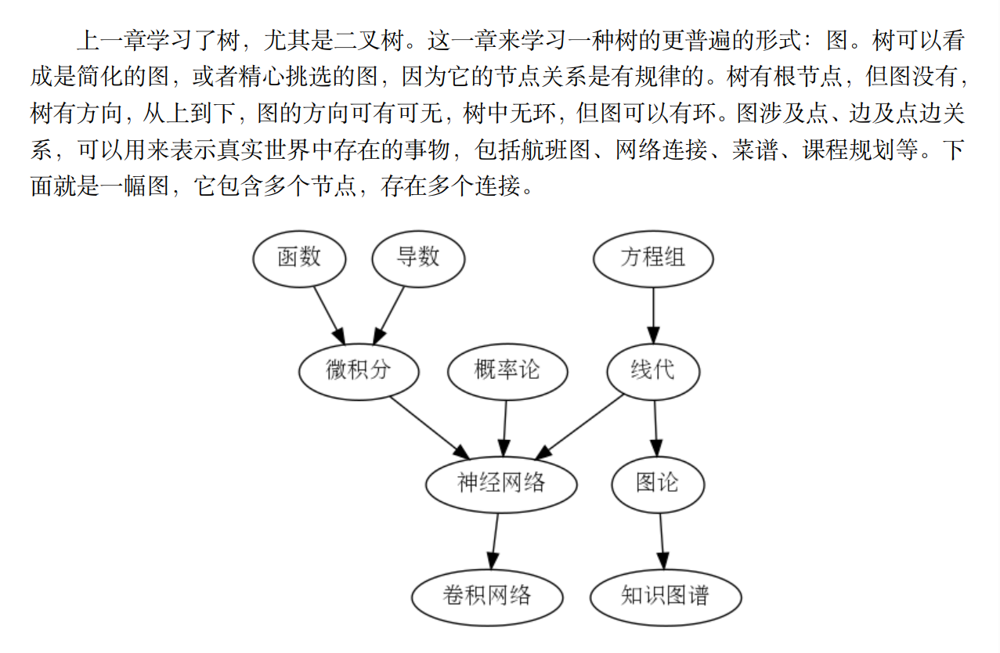

# 图

## 本章目标
- 了解图的概念及其使用方法
- 用 Rust 来实现图数据结构
- 使用图来解决各类现实问题


## 什么是图


### 定义
- 顶点: 也就是树中所说的节点，是图的元素，它有一个名称: 键。一个顶点也可能有额外的信息: 有效载荷
- 边: 图的另一个元素。边连接两个顶点，表明顶点之间的关系。边可以是单向的或双向的。如图中边都是单向的，称该图是有向图
- 权重: 是边的度量。用一个数值来表示从一个顶点到另一个顶点的距离、成本、时间、亲密度等


## 图的存储形式
### 邻接矩阵
邻接矩阵采用二维矩阵存储图的节点和边及权重，对于N个点的图来说，需要N^2个空间   
邻接矩阵简单、直观，对于小图，容易看出节点之间的连接关系   
如果有N个顶点，那么矩阵所需的存储为N^2，非常浪费内存


### 邻接表
邻接表使用数组来保存所有顶点的主列表，然后图中的每个主顶点维护一个连接到其他顶点的链表   
用邻接表实现的图是紧凑的，没有内存浪费


## 图的抽象数据类型
- new() 创建一个空图，不需要参数，返回空图
- add_vertex(v) 添加一个顶点，需要参数 v，无返回内容
- add_edge(fv,tv,w) 添加带权重的有向边，需要起点 fv 和终点 tv 及权重，无返回值
- get_vertex(vk) 在图中找到键为 vk 的点，需要参数 vk，返回点
- get_vertices() 返回图中所有顶点的列表，不需要参数
- vert_nums() 返回图中顶点数，不需要参数
- edge_nums() 返回图中边数，不需要参数
- contains(vk) 判断点是否在图中，需要参数 vk，返回布尔值
- is_empty() 判断图是否为空，不需要参数，返回布尔值

### 图操作示意
(1,5,2) 表示顶点1和顶点5之间的边的权重为2

| No | 图操作               | 图当前值                      | 操作返回值 |
|----|-------------------|---------------------------|-------|
| 1  | g.is_empty()      | []                        | true  |
| 2  | g.add_vertex(1)   | [1]                       |       |
| 3  | g.add_vertex(5)   | [5]                       |       |
| 4  | g.add_edge(1,5,2) | [1,5,(1,5,2)]             |       |
| 5  | g.get_vertex(5)   | [1,5,(1,5,2)]             | 5     |
| 6  | g.get_vertex(4)   | [1,5,(1,5,2)]             | None  |
| 7  | g.edge_nums()     | [1,5,(1,5,2)]             | 1     |
| 8  | g.vert_nums()     | [1,5,(1,5,2)]             | 2     |
| 9  | g.contains(1)     | [1,5,(1,5,2)]             | true  |
| 10 | g.get_vertices()  | [1,5,(1,5,2)]             | [1,5] |
| 11 | g.add_vertex(7)   | [1,5,7,(1,5,2)]           |       |
| 12 | g.add_vertex(9)   | [1,5,7,9,(1,5,2)]         |       |
| 13 | g.add_edge(7,9,8) | [1,5,7,9,(1,5,2),(7,9,8)] |       |

| 1 | ——> (5; 2)   
| 5 |   
| 7 | ——> (9; 8)   
| 9 |


## 图的实现
### 字梯问题


## 广度优先搜索
### 骑士之旅


## 深度优先搜索
### 拓扑排序

拓扑排序是深度优先搜索的一种改造，拓扑排序的算法如下:
1. 对图g调用dfs()，用深度优先搜索的来计算每个顶点的结束时间
2. 以结束时间的递减顺序将顶点存储在列表中
3. 返回有序列表作为拓扑排序的结果


## 强连通分量

强连通: 指在某个区域内，从任意节点可在有限路径内到达另一节点

计算强连通分量的算法步骤如下:
1. 调用dfs为G计算每个点的结束时间
2. 计算G^T，并为图G^T调用dfs，计算每个点结束时间
3. 输出每个森林中每棵树顶点的标志组件


## 最短路径问题
### Dijkstra算法
Dijkstra算法是一种贪心迭代算法，它为我们提供从一个特定起始节点到图中所有其他节点的最短路径，这有点类似于广度优先搜索


在互联网上使用Dijkstra算法的一个问题是，为了使算法运行，你必须有完整的网络的图表示，实际上这是根本不可能的  
实际中网络信息传递使用的是距离矢量路由协议和链路状态路由协议  
总的时间复杂度为 O((V + E)logV)


## 总结
```text
   本章学习了图抽象数据类型，以及图的实现。图在网络，交通，计算机，人工智能知识
图谱等领域非常有用。图使我们能够解决许多问题，只要可以将原始问题转换为图表示。图
在以下领域有较好的应用。
```
- 强连通分量用于简化图。
- 深度优先搜索图的深分支。
- 拓扑排序用于理清复杂的图连接。
- Dijkstra 用于搜索加权图的最短路径。
- 广度优先搜索用于搜索无加权图的最短路径。
